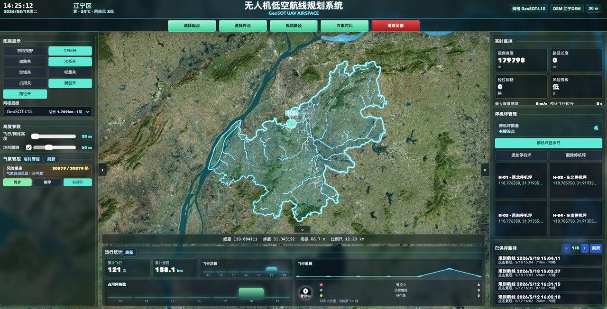
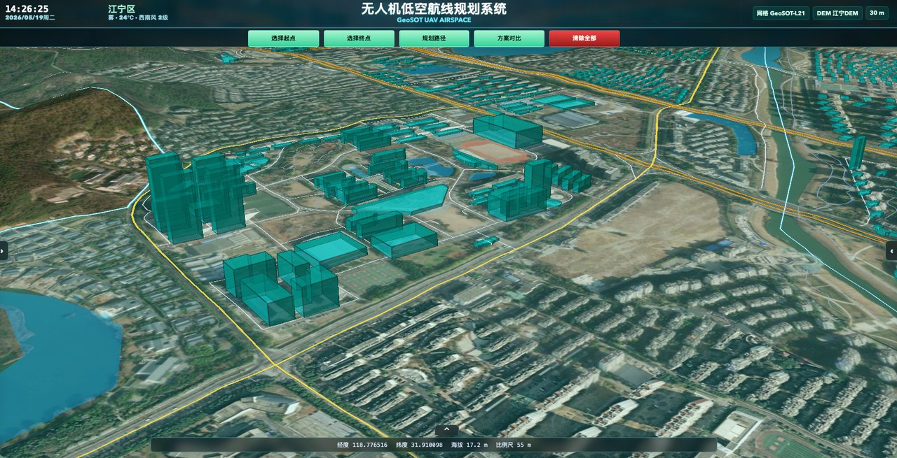
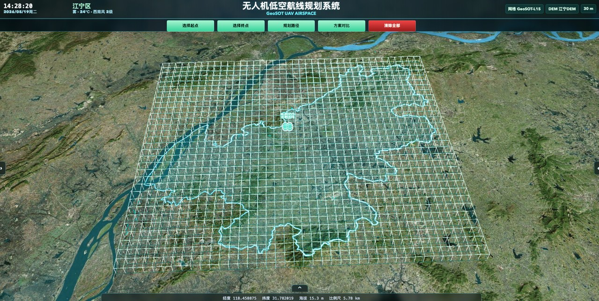
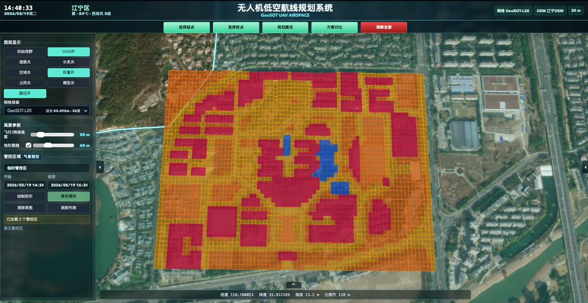
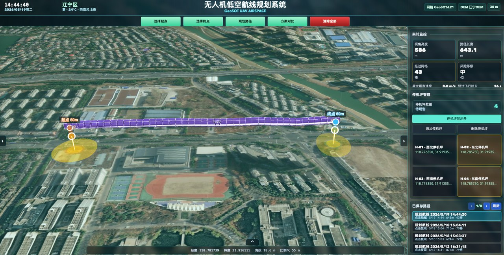
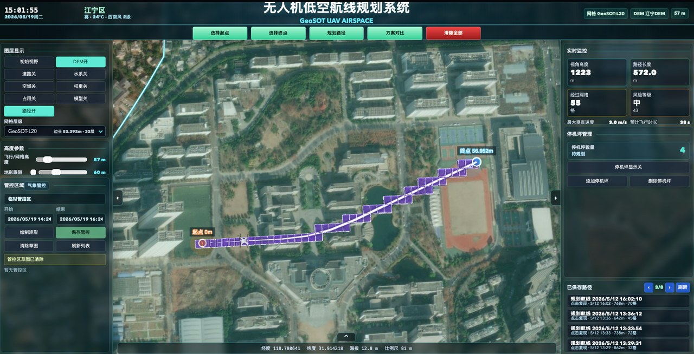
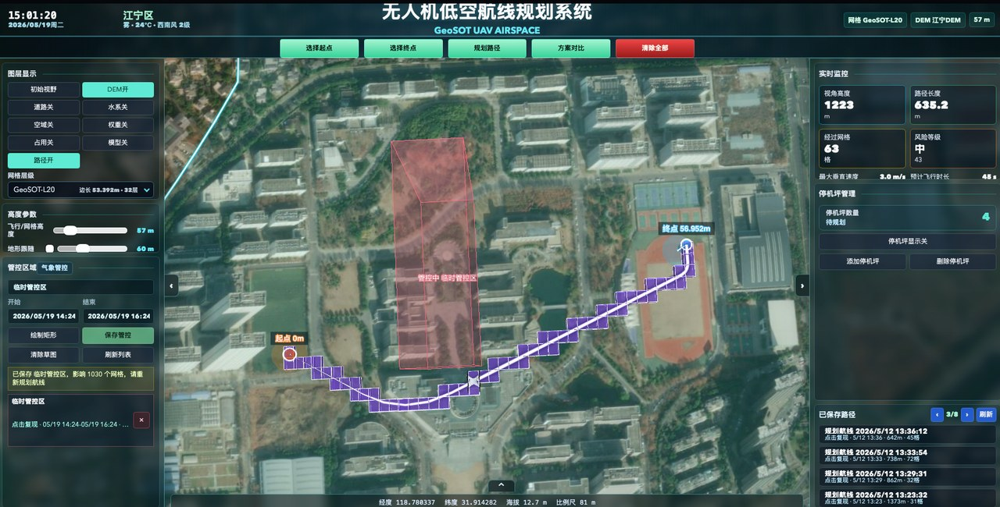
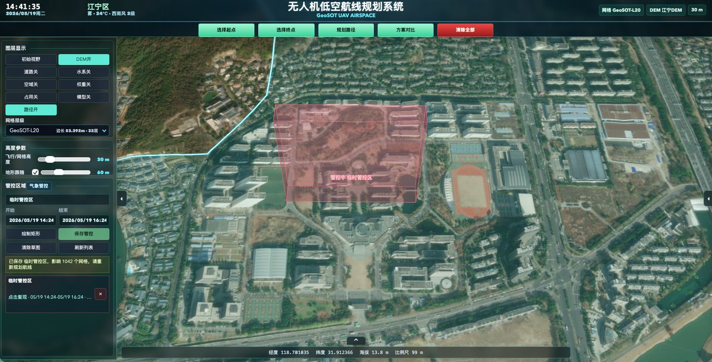
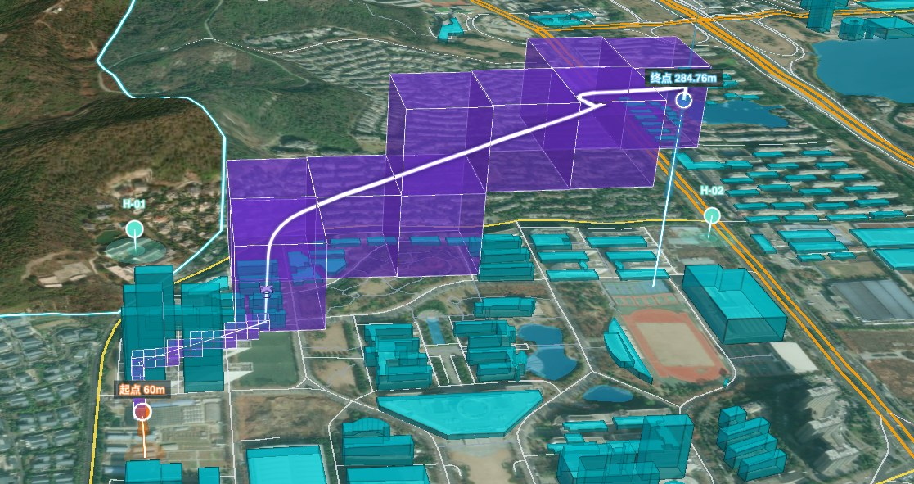

# 低空无人机 GeoSOT 航线规划系统

[English](./README.md)

本仓库包含一个基于 GeoSOT 空域剖分单元与状态管控思想构建的低空无人机航线规划原型系统。

该项目面向低空空域精细化管理研究，将连续低空空间转换为可编码、可查询、可赋权、可管控的三维网格单元，并在此基础上实现航线规划、临时管控、气象管控、路径归档和时空占用分析等功能。

## 主要功能

- 多层级 GeoSOT 空域网格显示
- 三维空域单元可视化
- L22 地表要素权重网格，覆盖道路、水域和建筑等要素
- 带时间窗的临时管控区域
- 气象管控与风险权重调整
- 带状态约束的改进 A* 航线规划
- Dijkstra 基线算法对比
- 路径归档与历史航线复现
- 路径占用时间戳，支撑后续多无人机冲突检查
- 基于 Cesium 的三维可视化界面

## 页面截图

以下截图只选取系统的部分典型界面，用于展示原型系统的主要能力。

### 系统总览



### 核心功能展示

| 三维场景与基础图层 | 多层级 GeoSOT 网格 |
| --- | --- |
|  |  |

| L22 地表权重层 | 停机坪管理 |
| --- | --- |
|  |  |

| 无管控区路径规划 | 状态约束下的绕行规划 |
| --- | --- |
|  |  |

| 临时管控区域 | 跨尺度三维格网显示 |
| --- | --- |
|  |  |

## 项目结构

```text
.
├── backend                    # Node.js / Express 后端接口与路径规划逻辑
├── frontend                   # Vue + Vite + Cesium 前端界面
├── database                   # 数据库补丁与说明
├── docs                       # Windows 运行说明与页面截图
├── setup_database.*           # 首次数据库初始化脚本
├── start_backend.*            # 后端启动脚本
├── start_frontend.*           # 前端启动脚本
├── restore_database.*         # 可选的本地数据库恢复脚本
├── .env.example               # 环境变量模板
├── README.md                  # 英文说明
└── README.zh-CN.md            # 中文说明
```

## 运行环境

- Node.js 20+
- PostgreSQL 与 PostGIS
- npm

系统默认连接名为 `uav-db` 的 PostgreSQL 数据库。数据库连接信息通过环境变量配置。首次运行时，请先复制 `.env.example` 为 `.env`，修改 PostgreSQL 密码，然后执行数据库初始化命令。

## 首次初始化

```bash
cp .env.example .env
# 修改 .env，将 PGPASSWORD=your_postgresql_password 替换为本机 PostgreSQL 密码。
```

初始化数据库并导入公开演示数据：

```bash
cd backend
npm install
npm run setup:database
```

初始化命令会在权限允许时自动创建数据库，启用 PostGIS 扩展，生成 GeoSOT 网格表，导入障碍物约束和 L22 地表权重，并应用最新数据库补丁。

## 启动后端

```bash
cd backend
npm install
npm start
```

也可以在仓库根目录直接使用启动脚本：

```bash
./start_backend.sh
```

后端默认地址：

```text
http://localhost:3000
```

健康检查接口：

```text
http://localhost:3000/api/levels
```

## 启动前端

```bash
cd frontend
npm install
npm run dev -- --host 127.0.0.1 --port 5173
```

前端访问地址：

```text
http://127.0.0.1:5173/
```

如果后端不是运行在 `localhost:3000`，请在启动前端前在 `.env` 中设置 `VITE_API_BASE`。

## 数据库说明

本仓库默认不包含完整数据库备份文件。完整 `.backup` 文件通常包含较大的本地运行数据，仓库公开时不建议提交。

`database/latest_schema_patch_20260518.sql` 包含路径归档、路径占用、停机坪、临时管控区域以及状态查询索引等最新运行结构。它是针对已有网格数据库的补丁，不是完整初始化脚本。若需要初始化完整数据库，请执行 `cd backend && npm run setup:database`。

## 安全说明

不要提交真实凭据或 token。

- PostgreSQL 密码：在本地设置 `PGPASSWORD`
- Cesium Ion token：如需使用，设置本地变量 `VITE_CESIUM_ION_TOKEN`
- QWeather key：如需气象同步，设置本地变量 `QWEATHER_API_KEY`

## 许可证

MIT License.
